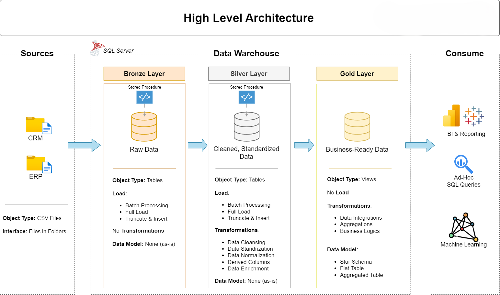

# Data Warehouse and Analytics Project

This project demonstrates a complete **end-to-end data warehouse pipeline** using the **Medallion Architecture** (Bronze → Silver → Gold) in **SQL Server**. It simulates a real-world retail environment by ingesting data from ERP and CRM sources, applying transformations, and modeling it into a star schema for reporting and analytics.

---

## 🧰 Tech Stack
- **Database**: SQL Server
- **Language**: T-SQL
- **Data Source**: CSV files (ERP and CRM systems)
- **Architecture**: Medallion (Bronze, Silver, Gold)
- **Modeling**: Star Schema (Fact & Dimension Views)

---

---
## 🏗️ Data Architecture

The data architecture for this project follows Medallion Architecture **Bronze**, **Silver**, and **Gold** layers:


### 🔹 Bronze Layer
- Raw data ingestion using `BULK INSERT`
- Source files from CRM and ERP (e.g., customer info, sales, product details)
- Stored procedure: `bronze.load_bronze`

### 🔸 Silver Layer
- Data cleansing, transformation, and normalization
- Examples: fixing date formats, deduplication, mapping codes to descriptions
- Stored procedure: `silver.load_silver`

### 🟡 Gold Layer
- Analytical-ready layer using **views**
- Modeled as **Star Schema**:
  - `dim_customers`, `dim_products` (Dimension Views)
  - `fact_sales` (Fact View)


---
## 📖 Project Overview

This project involves:

1. **Data Architecture**: Designing a Modern Data Warehouse Using Medallion Architecture **Bronze**, **Silver**, and **Gold** layers.
2. **ETL Pipelines**: Extracting, transforming, and loading data from source systems into the warehouse.
3. **Data Modeling**: Developing fact and dimension tables optimized for analytical queries.
4. **Analytics & Reporting**: Creating SQL-based reports and dashboards for actionable insights.

---

## 🧪 Exploratory Data Analysis (EDA)

Performed EDA using SQL queries on the Gold Layer to derive business insights:
- **Database Exploration**: Table and schema overview  
- **Dimension Analysis**: Unique values, country distributions, categories  
- **Date Range Analysis**: First/last order date, customer age range  
- **Key Metrics**: Total sales, average price, number of orders  
- **Magnitude Analysis**: Grouped totals by category, gender, and region  
- **Ranking Analysis**: Top products, high-value customers, worst performers

---

## 📊 Sample Business Questions Answered
- Who are the top 5 customers by revenue?
- What are the 5 best-selling and worst-performing products?
- What is the average product cost by category?
- Which countries have the most customers or sales?

---

## 🚀 Highlights
- Created a robust, reusable ETL pipeline with proper error handling (`TRY-CATCH`)
- Demonstrated schema design, transformation logic, and optimization
- Built a foundation for integration with BI tools like Power BI or Tableau


## 🚀 Project Requirements

### Building the Data Warehouse (Data Engineering)

#### Objective
Develop a modern data warehouse using SQL Server to consolidate sales data, enabling analytical reporting and informed decision-making.

---

#### Specifications
- **Data Sources**: Import data from two source systems (ERP and CRM) provided as CSV files.
- **Data Quality**: Cleanse and resolve data quality issues prior to analysis.
- **Integration**: Combine both sources into a single, user-friendly data model designed for analytical queries.
- **Scope**: Focus on the latest dataset only; historization of data is not required.
- **Documentation**: Provide clear documentation of the data model to support both business stakeholders and analytics teams.

---

### BI: Analytics & Reporting (Data Analysis)

#### Objective
Develop SQL-based analytics to deliver detailed insights into:
- **Customer Behavior**
- **Product Performance**
- **Sales Trends**

These insights empower stakeholders with key business metrics, enabling strategic decision-making.  

For more details, refer to [docs/requirements.md](docs/requirements.md).

## 📂 Repository Structure
```
data-warehouse-project/
│
├── datasets/                           # Raw datasets used for the project (ERP and CRM data)
│
├── docs/                               # Project documentation and architecture details
│   ├── etl.drawio                      # Draw.io file shows all different techniquies and methods of ETL
│   ├── data_architecture.drawio        # Draw.io file shows the project's architecture
│   ├── data_catalog.md                 # Catalog of datasets, including field descriptions and metadata
│   ├── data_flow.drawio                # Draw.io file for the data flow diagram
│   ├── data_models.drawio              # Draw.io file for data models (star schema)
│   ├── naming-conventions.md           # Consistent naming guidelines for tables, columns, and files
│
├── scripts/                            # SQL scripts for ETL and transformations
│   ├── bronze/                         # Scripts for extracting and loading raw data
│   ├── silver/                         # Scripts for cleaning and transforming data
│   ├── gold/                           # Scripts for creating analytical models
│
├── tests/                              # Test scripts and quality files
│
├── README.md                           # Project overview and instructions
├── .gitignore                          # Files and directories to be ignored by Git
└── requirements.txt                    # Dependencies and requirements for the project
```
---


---

## 🧠 Learning Outcomes
- Gained hands-on experience with **data warehousing architecture**
- Practiced real-world **ETL pipeline design** and **data modeling**
- Strengthened SQL skills with **advanced queries and optimization**

---

## 📌 Status
✅ Completed — Ready to be showcased to recruiters and hiring managers  
📅 Timeline: May 2025  
💡 Ideal for: SQL Developer, Data Analyst, Junior Data Engineer roles

---

## 🔗 Contact
**Steve Monteiro**  
📧 [monteiro.steve7@gmail.com]  
🌐 [LinkedIn](https://www.linkedin.com/in/steve-monteiro-02360a226/) | 
[GitHub](https://github.com/SteveM34)

